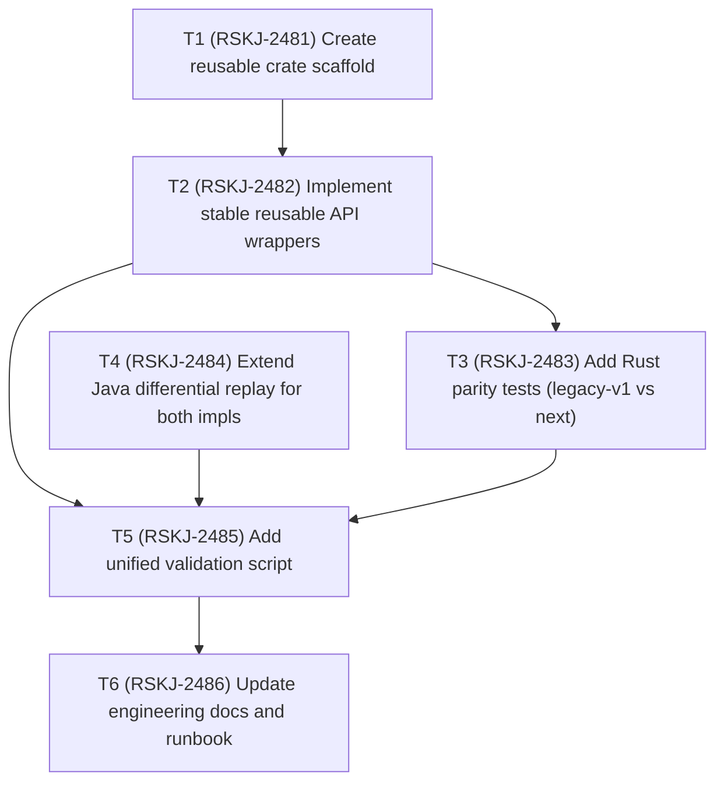

# Unitrie-rs Core Modularization TODO

Status date: 2026-02-14

## Dependency graph

## Execution TODO list

- [x] `T1` `status: done` `depends_on: []` `jira: RSKJ-2481`
  - Create new reusable crate `unitrie-rs-core` with no JNI dependency by default.
- [x] `T2` `status: done` `depends_on: [T1]` `jira: RSKJ-2482`
  - Expose a stable modular API (`UnitrieCore`, implementation selector, store adapter bridge).
- [x] `T3` `status: done` `depends_on: [T2]` `jira: RSKJ-2483`
  - Add deterministic Rust tests validating `next` against `legacy-v1`.
- [x] `T4` `status: done` `depends_on: []` `jira: RSKJ-2484`
  - Update Java corpus replay test to run against both Rust implementations.
- [x] `T5` `status: done` `depends_on: [T2, T3, T4]` `jira: RSKJ-2485`
  - Add one command/script to validate reusable crate + Java differential replay path.
- [x] `T6` `status: done` `depends_on: [T5]` `jira: RSKJ-2486`
  - Document reusable-crate usage and validation flow (including future Reth integration note).
