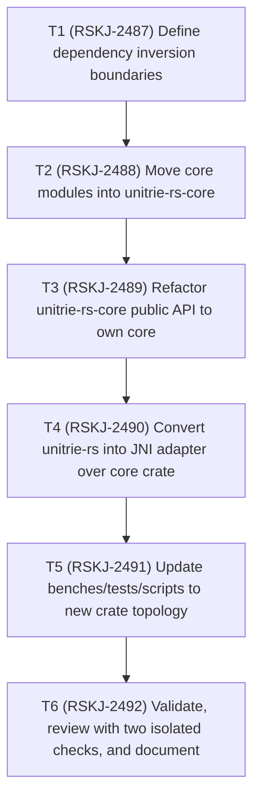

# Unitrie-rs Dependency Inversion TODO

Status date: 2026-02-14

## Dependency graph

## Execution TODO list

- [x] `T1` `status: done` `depends_on: []` `jira: RSKJ-2487`
  - Lock source-of-truth module ownership and compatibility requirements for JNI and parity flows.
- [x] `T2` `status: done` `depends_on: [T1]` `jira: RSKJ-2488`
  - Relocate Rust core modules (`core_trie`, codecs, node/path/hash/store/next) from `unitrie-rs` to `unitrie-rs-core`.
- [x] `T3` `status: done` `depends_on: [T2]` `jira: RSKJ-2489`
  - Make `unitrie-rs-core` compile standalone as the real implementation source and preserve current core API behavior.
- [x] `T4` `status: done` `depends_on: [T3]` `jira: RSKJ-2490`
  - Refactor `unitrie-rs` to keep only JNI adapter/runtime glue and consume `unitrie-rs-core`.
- [x] `T5` `status: done` `depends_on: [T4]` `jira: RSKJ-2491`
  - Update benchmarks/tests/scripts/imports for the new dependency direction.
- [x] `T6` `status: done` `depends_on: [T5]` `jira: RSKJ-2492`
  - Run full validations, perform two independent review passes, fix findings, and update docs/TODO statuses.
